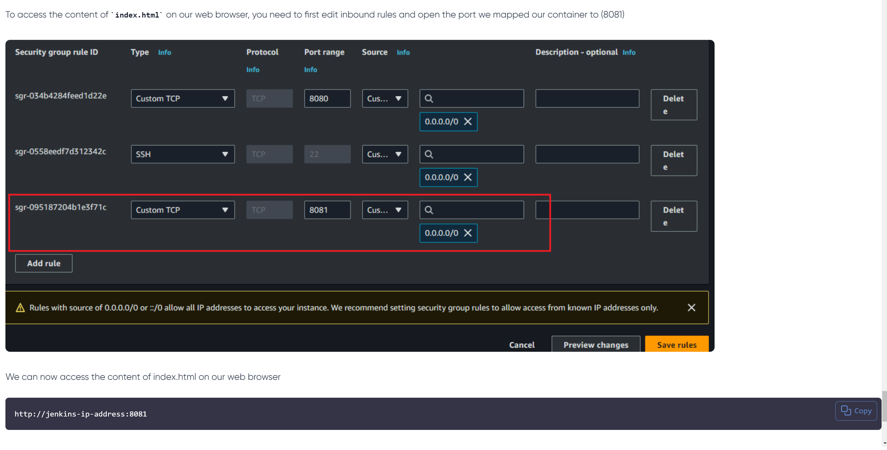

# Jenkins Pipeline Job

Use the script in the jenkinsfile to create your pipeline

Use the docker.sh file in the repo to install docker on your server.

Use the Dockerfile in the repo to create this step.

